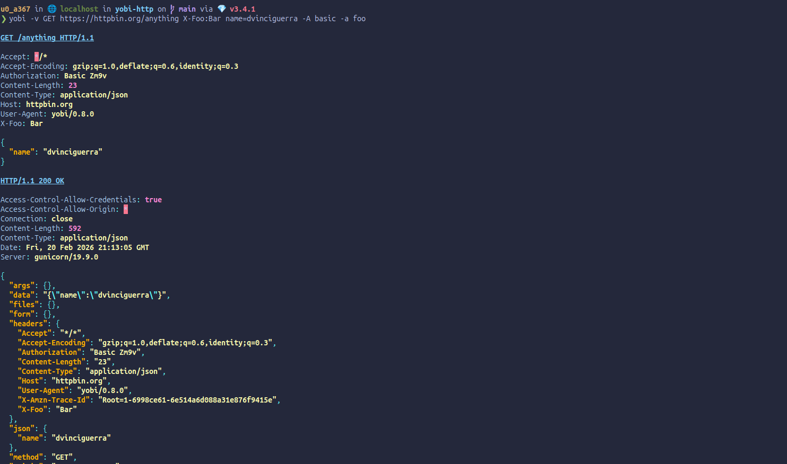

[](https://badge.fury.io/rb/yobi-http)
[](https://opensource.org/licenses/MIT)
[](https://qlty.sh/gh/dvinciguerra/projects/yobi-http)

# Yobi(呼び) Http Client

Yobi is a Ruby gem that provides a simple and efficient way to make HTTP requests. It is designed to be easy to use
and flexible, allowing you to customize your requests as needed.

Its a lightweight implementation of the HTTPie tool, which is a command-line HTTP client that allows you to make
HTTP requests and view the responses in a human-friendly format.



## Installation

```bash
gem install yobi-http
```

## Usage

Some examples of how to use yobi:

- `yobi GET https://jsonplaceholder.typicode.com/posts/1` - Makes a GET request to the specified URL and prints the response.
- `yobi POST https://jsonplaceholder.typicode.com/posts title="foo" body="bar" userId=1` - Makes a POST request to the specified URL with the given data and prints the response.
- `yobi GET https://jsonplaceholder.typicode.com/posts/1 Authorization:"Bearer <token>"` - Makes a GET request to the specified URL with the given header and prints the response.

## Development

After checking out the repo, run `bin/setup` to install dependencies. You can also run `bin/console` for an interactive prompt that will allow you to experiment.

To install this gem onto your local machine, run `bundle exec rake install`. To release a new version, update the version number in `version.rb`, and then run `bundle exec rake release`, which will create a git tag for the version, push git commits and the created tag, and push the `.gem` file to [rubygems.org](https://rubygems.org).

## Contributing

Bug reports and pull requests are welcome on GitHub at https://github.com/dvinciguerra/yobi-http. This project is intended to be a safe, welcoming space for collaboration, and contributors are expected to adhere to the [code of conduct](https://github.com/dvinciguerra/yobi-http/blob/main/CODE_OF_CONDUCT.md).

## Code of Conduct

Everyone interacting in the yobi-http project's codebases, issue trackers, chat rooms and mailing lists is expected to follow the [code of conduct](https://github.com/dvinciguerra/yobi-http/blob/main/CODE_OF_CONDUCT.md).
