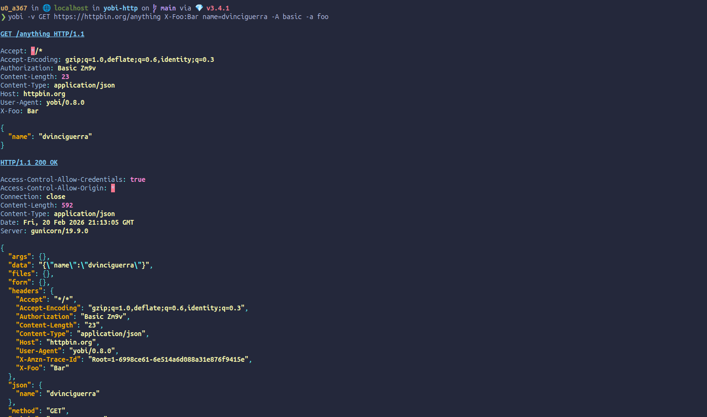

[](https://badge.fury.io/rb/yobi-http)
[](https://opensource.org/licenses/MIT)
[](https://qlty.sh/gh/dvinciguerra/projects/yobi-http)

# :zap: Yobi(呼び) Http Client

Yobi (呼び) is a modern HTTP client for the command line, written in Ruby, that makes interacting with APIs simple, intuitive, and fun. Inspired by HTTPie, Yobi provides an elegant way to make HTTP requests with formatted and readable output.



#### Main Features

* Simple and intuitive interface - Natural and easy-to-remember syntax
* Automatic formatting - JSON responses with syntax highlighting
* Multiple authentication types - Basic, Bearer, Digest, and more
* File download - Save responses directly to files
* Redirect tracking - Automatically follow HTTP redirects
* Customizable output - Control exactly what you want to see (headers, body, or both)
* Full HTTP support - GET, POST, PUT, DELETE, PATCH, HEAD, OPTIONS
* Offline mode - Prepare and review requests without sending them
* No heavy dependencies - Quick installation via RubyGems
* Raw mode - Raw output for integration with other tools


## Installation

#### Prerequisites

* Ruby >= 3.0.0
* RubyGems (usually included with Ruby)

#### Via RubyGems (Recommended)

```bash
gem install yobi-http
```

#### From Source Code

```bash
# Clone the repository
git clone https://github.com/dvinciguerra/yobi-http.git
cd yobi-http

# Install dependencies
bundle install

# Install the gem locally
bundle exec rake install```bash
gem install yobi-http
```

#### Check Installation

```bash
yobi --version
```

If you receive command not found: yobi:

* Ensure that the RubyGems bin directory is in your PATH.
* Try using gem which yobi-http to locate the installation.


## Quick Guide

#### Basic Syntax

```bash
yobi [METHOD] <url> [HEADER:VALUE] [key=value] [key::value]
```

### Instant Examples

```bash
# Simple GET
yobi https://api.github.com/users/github

# POST with JSON
yobi POST https://jsonplaceholder.typicode.com/posts \
  title="Hello" \
  body="World" \
  userId=1

# With authentication
yobi -A basic -a username:password https://api.example.com/data

# WITH custom header
yobi GET https://api.example.com/data \
  Authorization:"Bearer your_token_here"

# Save response to file
yobi https://api.example.com/data -o response.json

# Use localhost shortcut
yobi :8080/api/items
# Expands to: http://localhost:8080/api/items
```

**JSONPlaceholder API (Testing Service)**

```bash
# Get all posts
yobi https://jsonplaceholder.typicode.com/posts

# Get specific post
yobi https://jsonplaceholder.typicode.com/posts/1

# Create new post
yobi POST https://jsonplaceholder.typicode.com/posts \
  title="My new post" \
  body="This is the content" \
  userId=1

# Update post
yobi PUT https://jsonplaceholder.typicode.com/posts/1 \
  title="Updated title"

# Delete post
yobi DELETE https://jsonplaceholder.typicode.com/posts/1
```

**GitHub API**

```bash
# User information
yobi https://api.github.com/users/dvinciguerra

# User repositories
yobi https://api.github.com/users/dvinciguerra/repos

# With authentication (personal token)
yobi -A bearer -a your_github_token https://api.github.com/user
```

**HTTPBin (API Testing Tool)**

```bash
# GET with query params
yobi https://httpbin.org/get name=John age=30

# POST with JSON
yobi POST https://httpbin.org/post name=John age:=30 active:=true

# Custom headers
yobi https://httpbin.org/headers \
  "X-Custom:value" \
  "User-Agent:Yobi/1.0"

# Basic authentication test
yobi https://httpbin.org/basic-auth/username/password \
  -A basic -a username:password

# Simulate delay
yobi https://httpbin.org/delay/5

# Test timeout
yobi --timeout 2 https://httpbin.org/delay/10
```

**Typical REST API**

```bash
# List resources
yobi GET https://api.example.com/v1/users

# Create resource
yobi POST https://api.example.com/v1/users \
  name="John Silva" \
  email="john@example.com" \
  department="IT"

# Update resource
yobi PUT https://api.example.com/v1/users/123 \
  name="John da Silva" \
  department="Development"

# Partial update
yobi PATCH https://api.example.com/v1/users/123 \
  department="Management"

# Delete resource
yobi DELETE https://api.example.com/v1/users/123

# With pagination
yobi GET https://api.example.com/v1/users \
  page:=1 \
  limit:=10

# With filters
yobi GET https://api.example.com/v1/users \
  department="IT" \
  status="active"
```


## Development

After checking out the repo, run `bin/setup` to install dependencies. You can also run `bin/console` for an interactive prompt that will allow you to experiment.

To install this gem onto your local machine, run `bundle exec rake install`. To release a new version, update the version number in `version.rb`, and then run `bundle exec rake release`, which will create a git tag for the version, push git commits and the created tag, and push the `.gem` file to [rubygems.org](https://rubygems.org).

## Contributing

Bug reports and pull requests are welcome on GitHub at https://github.com/dvinciguerra/yobi-http. This project is intended to be a safe, welcoming space for collaboration, and contributors are expected to adhere to the [code of conduct](https://github.com/dvinciguerra/yobi-http/blob/main/CODE_OF_CONDUCT.md).

## Code of Conduct

Everyone interacting in the yobi-http project's codebases, issue trackers, chat rooms and mailing lists is expected to follow the [code of conduct](https://github.com/dvinciguerra/yobi-http/blob/main/CODE_OF_CONDUCT.md).
